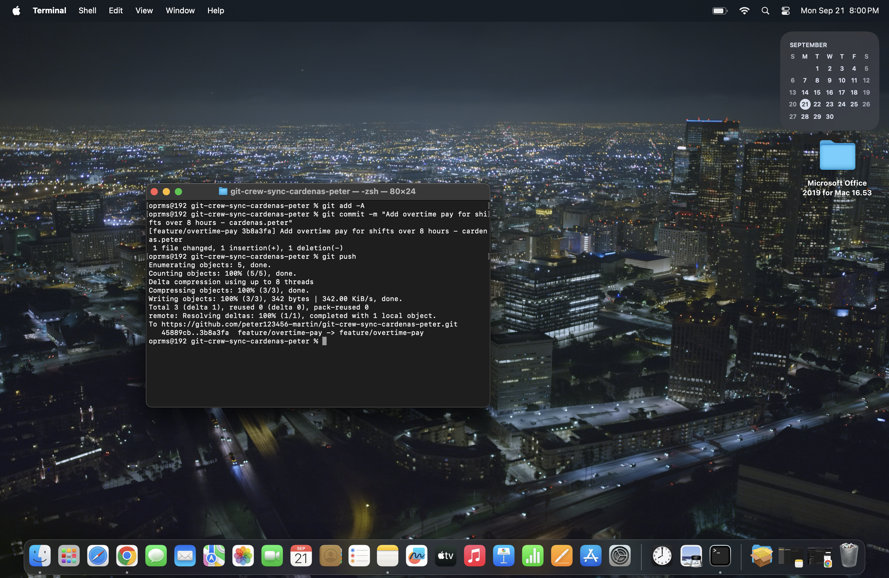
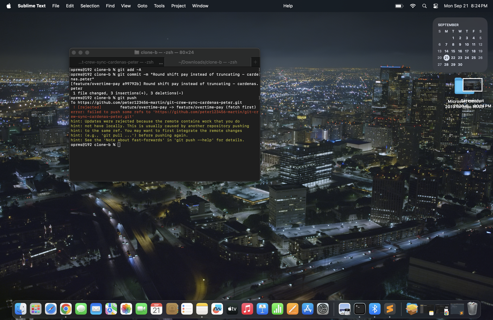
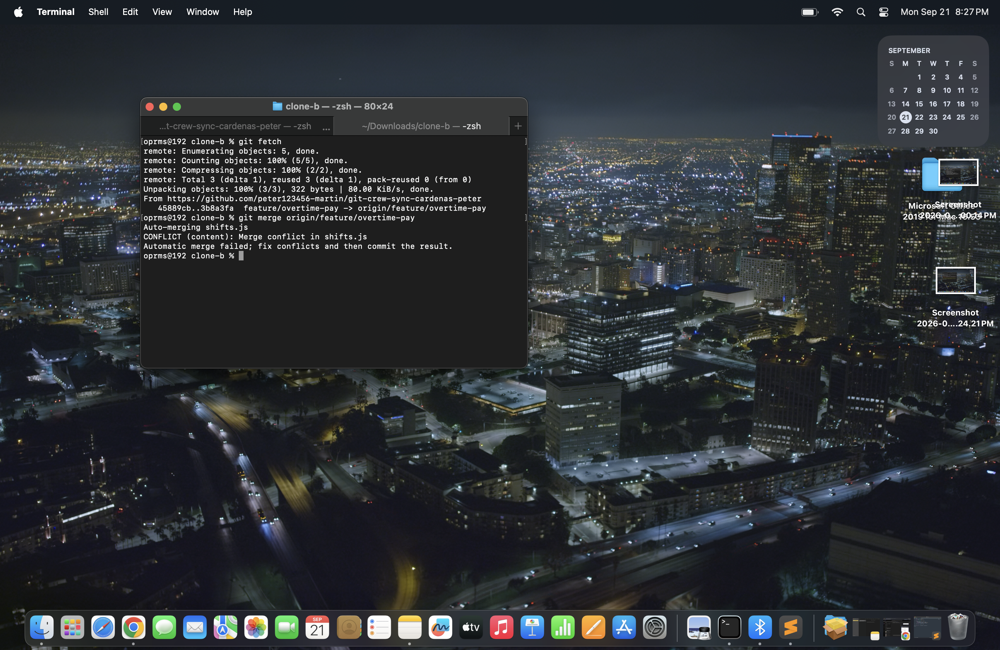
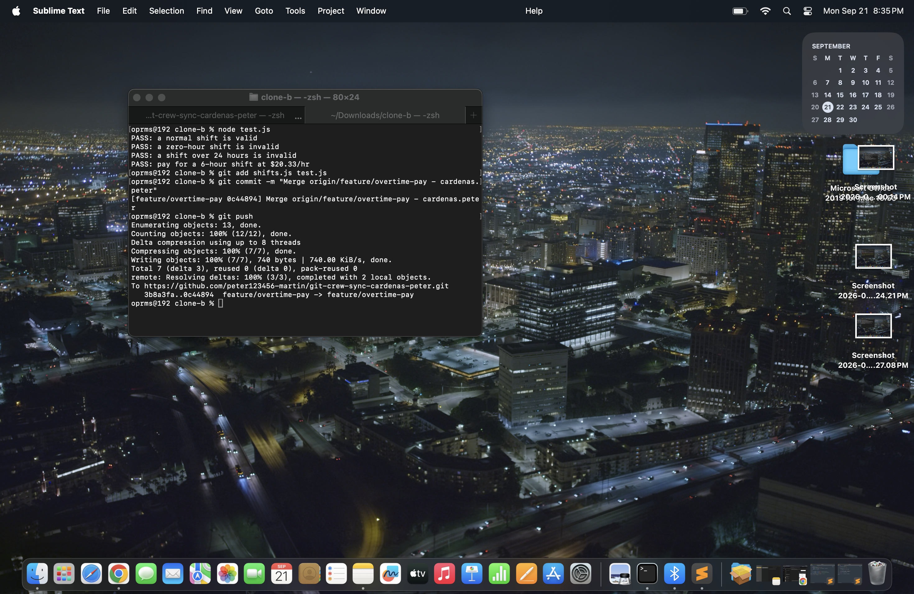
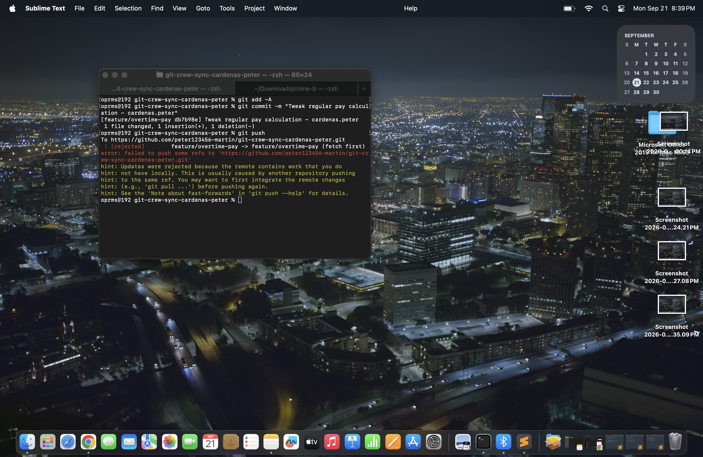
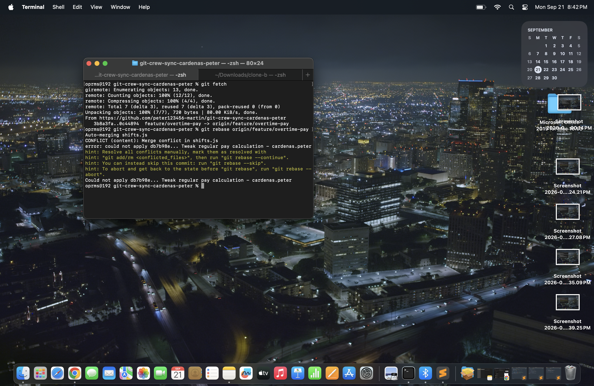
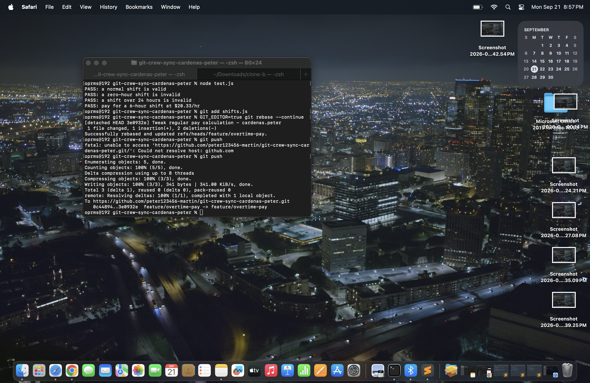
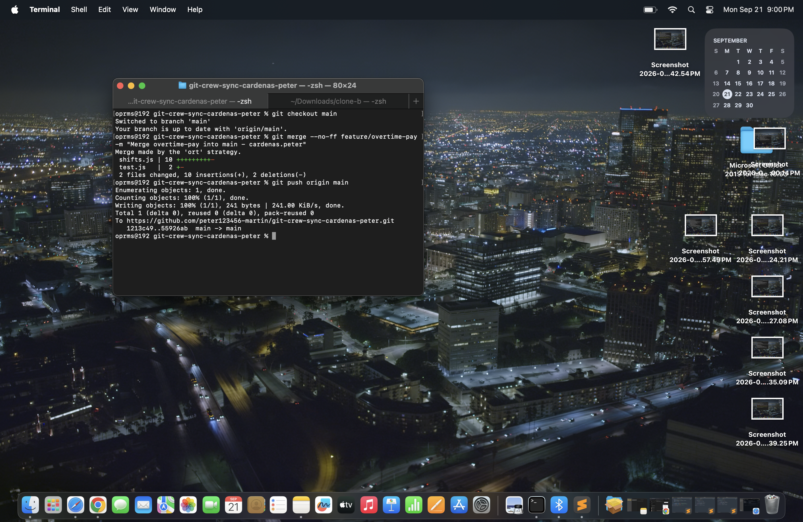
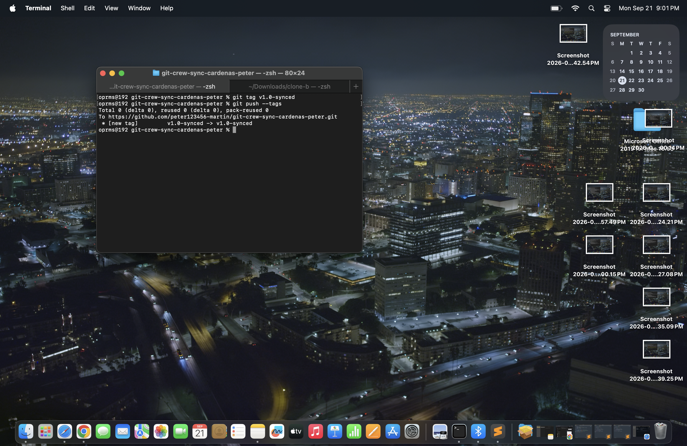
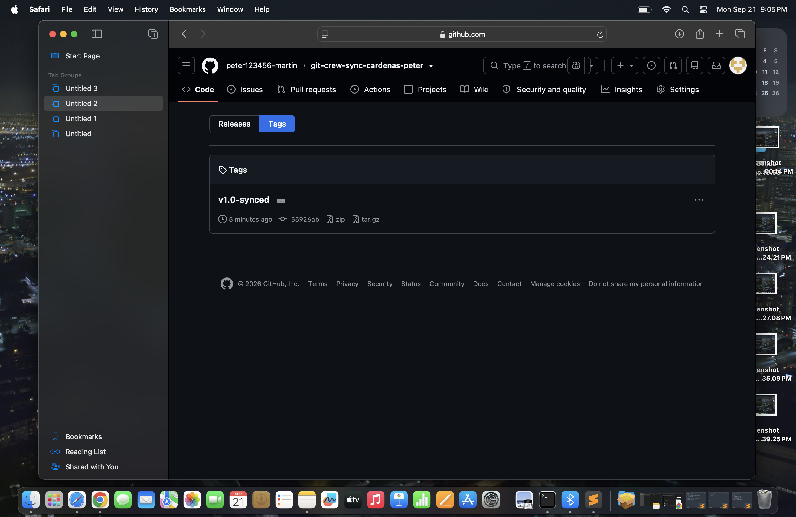

# WORKFLOW - cardenas.peter

## Task 1: Push from Clone A

In Clone A, I checked out feature/overtime-pay, added overtime pay for shifts over 8 hours (time-and-a-half), committed with my name at the end of the message, and pushed to the shared remote. The push succeeded (45889cb..3b8a3fa).

## Task 2: Rejected push from Clone B

In Clone B, I checked out feature/overtime-pay and changed the same function to round shift pay instead of truncating it. I committed and ran git push. Git rejected it with "! [rejected] feature/overtime-pay -> feature/overtime-pay (fetch first)" because Clone A had already pushed a different commit to that branch and Clone B hadn't fetched it yet.

## Task 3: Merge

In Clone B, I ran git fetch and then git merge origin/feature/overtime-pay. Git reported a merge conflict in shifts.js because both clones changed the same function. I edited the file by hand so both behaviors survive (overtime pay and rounding), removed the conflict markers, and ran node test.js. All tests passed. I then staged the files, committed the merge, and pushed successfully (3b8a3fa..0c44894).

## Task 4: Rebase

In Clone A, without fetching first, I made another change to the regular pay calculation, committed, and tried to push. It was rejected again with (fetch first). This time I ran git fetch and git rebase origin/feature/overtime-pay. Git stopped with a conflict in shifts.js. I resolved it, ran node test.js (all PASS), staged the file, ran git rebase --continue, and pushed without --force (0c44894..3e0932e).

## Task 5: Merge into main

In Clone A, I checked out main and merged feature/overtime-pay with git merge --no-ff so the merge commit carries my name. Then I pushed main (1213c49..55926ab).

## Task 6: Tag

I tagged the final commit v1.0-synced and pushed it with git push --tags. The tag also shows on my GitHub repo's Tags page, on commit 55926ab.

## Questions

**1. What did the rejected push error message tell you, and why did it happen?**

It said the push was rejected (fetch first) because the remote had work I didn't have locally. Clone A had already pushed to the same branch, and Clone B hadn't fetched it, so Git refused to overwrite that work. The hint said to integrate the remote changes (for example with git pull) before pushing again.

**2. What's the actual difference between how you resolved Task 3 (merge) vs Task 4 (rebase)?**

In Task 3, I merged. Git combined both lines of work with a new merge commit, so the history shows exactly when the two branches came together. In Task 4, I rebased. Git replayed my commit on top of the remote's latest commit, so the history stays in a straight line with no merge commit, but my commit was rewritten and got a new hash.

**3. What one habit would have avoided both rejected pushes?**

Running git fetch or git pull before starting work and before pushing, so my local branch is up to date with the remote.

**4. Which approach, merge or rebase, would you default to on a shared team branch, and why?**

Merge. It doesn't rewrite commits that other people may already have pulled, so it's safe on shared branches. Rebase is better for my own local commits that haven't been pushed yet, because it keeps history clean without affecting anyone else.
 